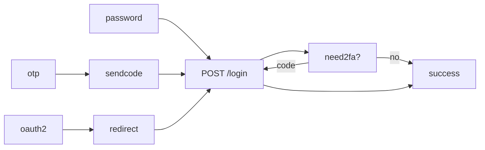
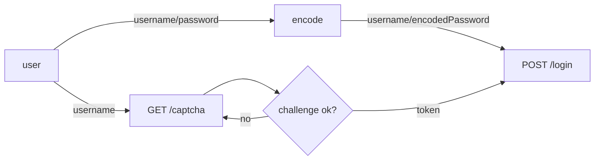
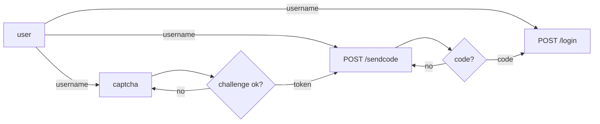
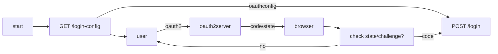

# auth

## 登录流程

用户打开浏览器进入平台任意页面地址，如果用户登录失效，某一接口会返回 401 状态码，前端根据此状态码跳转到登录页面。

前置条件：

- 任意接口返回 401 状态码后，前端跳转到登录页面
- 用户打开浏览器进入登录页面

登录页面：

1. 请求 GET /current/account 获取当前登录用户信息
   1. 如果已经登录，则会返回当前的账户信息，前端判断成功响应后需要跳转到首页或者重定向到之前的页面。
   1. 如果未登录，则返回 401 状态码，继续登录流程。
1. 请求 GET /login-config 获取登录配置信息，这些信息包括当前支持的登录方式，如密码登录、短信验证码登录、第三方登录等。

   ```json
   {
     "allowSignup": false,
     "methods": [
       // 密码登录
       {
         "type": "Password",
         "password": {
           // 密码编码方式，支持 BCrypt 和 PlainText
           "algorithm": "PlainText"
         }
       },
       // 一次性密码登录
       {
         "type": "OTP",
         "otp": {
           "provider": "auto"
         }
       },
       // 第三方登录
       {
         "type": "OAuth2",
         "oauth2": {
           "provider": "provider_ju4pyq",
           "authorizeURL": "https://github.com/login/oauth/authorize",
           "clientID": "f03ece2c527051f4175f",
           "scope": "user:email read:user",
           "responseType": "code"
         }
       },
       {}
     ]
   }
   ```

1. 前端根据配置信息，展示登录方式，用户选择登录方式，
   1. 若选择密码登录，参考密码登录流程。
   1. 若选择一次性密码登录，参考一次性密码登录流程。

### 密码登录

1. 用户输入用户名，密码，点击登录按钮。
1. 前端根据 login-config 返回的配置信息中 password.algorithm 对密码进行编码

   1. 如果 password.algorithm 为空或者为`PlainText`，则编码为明文密码。
   1. 如果 password.algorithm 为`BCrypt`，则密码为 BCrypt 编码后的密码。

1. 请求 POST /login，传递登录方式 `.type`、用户名、编码后的密码。

   ```http
   POST /login HTTP/1.1
   Content-Type: application/json

   {
       "type": "Password",
       "username": "admin",
       "password": {
           "algorithm": "BCrypt",
           "value": "$2a$10$1Q" // BCrypt 编码后的密码
       }
   }
   ```

1. 如果登录成功，返回状态码为 200 ，否则返回错误状态码。
1. 前端需要解析错误信息中的 `.reason` 字段以提示用户错误的类型或者采取下一步操作，

   1. 如果 reason 为`NeedCaptcha`，则本次登录需要验证码，转到 验证码流程。
   1. 将验证结果附加到 POST /login 的请求参数中，再次请求登录接口。转到步骤 3。

      ```http
      POST /login HTTP/1.1
      Content-Type: application/json

      {
          "type": "Password",
          "username": "admin",
          "password": {
              "algorithm": "BCrypt",
              "value": "$2a$10$1Q" // BCrypt 编码后的密码
          },
          "captcha": {
              "name": "provider_captcha_default",
              "code": "1234"
          }
      }
      ```

1. 用户名密码验证成功，返回登录成功响应。判断是否需要近一步验证。

   ```json
   {
     "next": "MFA",
     "mfa": {
       "enabled": true,
       "type": "OTP",
       "otp": {
         "provider": "app"
       }
     }
   }
   ```

   1. 如果 next 为`MFA`，则需要进行二次验证，跳转到 `MFA 流程`,`.mfa` 为验证配置。
   1. 如果 next 为空，则登录成功，跳转到首页或者之前的页面。

### 验证码流程

1. GET /captcha 获取验证码配置

   ```json
   {
     "name": "provider_captcha_default",
     "provider": "Graphic",
     "action": "",
     "key": "9fHVRV0Y33Xy0Q6UPVBU",
     "params": {
       "image": "<base64img/url>"
     }
   }
   ```

1. 根据 `.provider` 字段，选择验证码类型，以根据不同的类型，展示不同的验证码输入方式。

   1. `Graphic` 图形验证码，在 `.params.image` 中包含验证码图片的 base64 编码或者图片地址。用户需要输入图片中展示的验证码作为返回 code。
   1. `ReCaptcha` Google reCAPTCHA 验证码，需要在页面中引入 reCAPTCHA 的 js 文件，然后调用 reCAPTCHA 的验证接口。用户验证通过后，将返回的 token 作为 code 返回。

1. 将 `.name` 和验证后的 code 组装为 `.captcha` 字段，附加到需要验证码的接口请求 body 中。

   ```http
   POST /login HTTP/1.1
   Content-Type: application/json

   {
       "type": "Password",
       "username": "admin",
       "password": {
           "algorithm": "BCrypt",
           "value": "$2a$10$1Q" // BCrypt 编码后的密码
       },
       "captcha": {
           "name": "provider_captcha_default",
           "code": "1234"
       }
   }
   ```

### 一次性密码登录（OTP）

1. 用户输入用户名，点击发送验证码按钮。
1. 根据 login-config 返回的配置信息中 otp.provider 获取验证码提供商。
1. 请求 POST /send-otp，传递验证方式 `.provider`、用户名。

   ```http
   POST /sendcode HTTP/1.1
   Content-Type: application/json

   {
       "username": "admin",
       "provider": "auto"
   }
   ```

1. 如果失败，则根据 `.reason` 字段提示用户错误信息或进行下一步操作。

   1. 如果 reason 为`NeedCaptcha`，则本次登录需要验证码，转到 验证码流程。
   1. 将验证结果附加到步骤 2 的请求参数中，再次请求登录接口。

      ```http
      POST /login HTTP/1.1
      Content-Type: application/json

      {
          "username": "admin",
          "provider": "auto",
          "captcha": {
              "name": "provider_captcha_default",
              "code": "1234"
          }
      }
      ```

1. 如果发送成功，返回状态码为 200 。
1. 用户等待验证码，输入验证码，点击登录按钮。

   ```POST /login
   {
        "type": "OTP",
        "username": "admin",
        "otp": {
            "provider": "auto",
            "code": "1234"
        }
   }
   ```

1. 如果登录成功，返回状态码为 200 ，否则返回错误状态码。

> 状态码 200 后的流程和密码登录流程一致。

### MFA 流程

1. 获取到 MFA 配置

   ```json
   {
     "enabled": true,
     "type": "OTP",
     "otp": {
       "provider": "app"
     }
   }
   ```

1. 如果`.enabled`为`false`， 表示需要二次验证，但是当前用户没有配置二次验证方式，跳转至 二次验证配置 流程。
1. 如果`.enabled`为`true`，则展示二次验证方式，用户选择二次验证方式，跳转到二次验证页面。多因子认证的方式有 OTP、PushNotification 等。

   1. 若 `.type` 为`OTP`，则展示 OTP 验证码输入框，用户输入 OTP 验证码，作为验证 code 。

      1. 用户点击验证按钮后，调用 mfa 验证接口。

         ```http
         POST {{host}}/v1/verify-mfa
         Content-Type: application/json

         {
             "provider": "app",
             "code": "346046"
         }
         ```

      1. 若验证成功，返回状态码为 200，否则返回错误状态码。

   1. 若 `.type` 为`PushNotification`，则展示 PushNotification 的验证方式，用户点击验证按钮，等待验证结果。（暂未实现）

## oidc flow

## login flow



## password flow



## otp flow



## oauth2 flow


